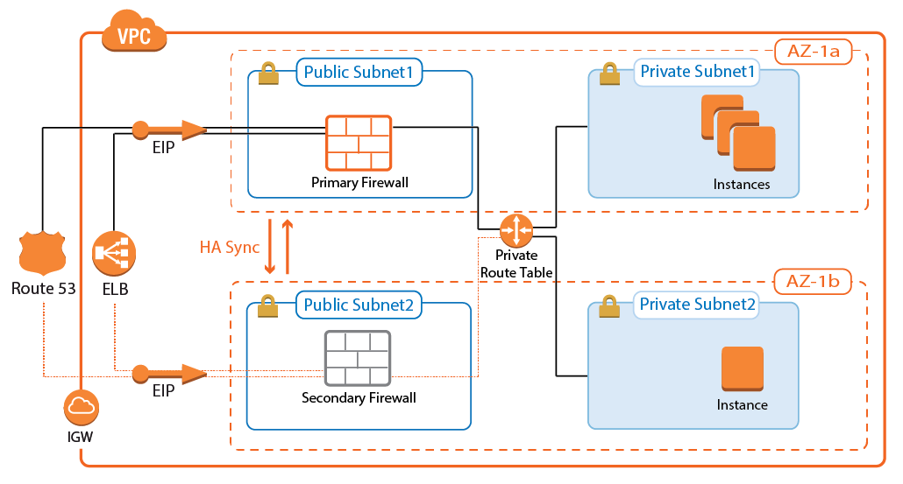

# HA Cluster of Barracuda NextGen Firewalls

## Introduction
This template deploys a VPC with a multi-AZ High Availability cluster of Barracuda NextGen Firewalls (stand-alone). The cluster works in active/passive mode, automatically rewriting route table upon failover and using Network Load Balancer for directing ingress traffic from public Internet.

More information on the architecture can be found at [Barracuda Campus](https://campus.barracuda.com/product/nextgenfirewallf/doc/54264714/aws-reference-architecture-nextgen-firewall-high-availability-cluster-with-route-shifting/)

## Prerequisites
Before attempting to deploy the solution you must create an IAM Role for Barracuda NextGen Firewalls. See [How to Create an IAM Role for an F-Series Firewall in AWS](https://campus.barracuda.com/product/nextgenfirewallf/article/NGF71/AWSCreateIAMRoleFW/) for details.

Solution does not check for availability of requested instance types in a given region. Please consult AWS documentation for instance type availability. Barracuda recommends use of **m4** or **c4** series.

## Deployed resources
Following resources will be created by the template:
- One VPC with public subnets in 2 Availability Zones
- One Network Load Balancers for production traffic with listeners on ports 443 and 691 for VPN traffic
- Two public IPs for management, one for each firewall
- Route table for private networks

**Note** The backend subnets and resources are *not* automatically created by the template. This has to be done manually after template deployment has finished.

## Launching the Template
Use NGF_HA.json file to launch the solution.

For instructions on how to launch a CloudFormation Template, consult AWS documentation or check [How to Deploy an F-Series Firewall in AWS via CloudFormation Template](https://campus.barracuda.com/product/nextgenfirewallf/article/NGF71/AWSDeployCloudFormationTemplate/) article in Barracuda Campus.

## Additional Resources
[AWS Reference Architecture - NextGen Firewall High Availability Cluster with Route Shifting](https://campus.barracuda.com/product/nextgenfirewallf/doc/54264714/aws-reference-architecture-nextgen-firewall-high-availability-cluster-with-route-shifting/)
