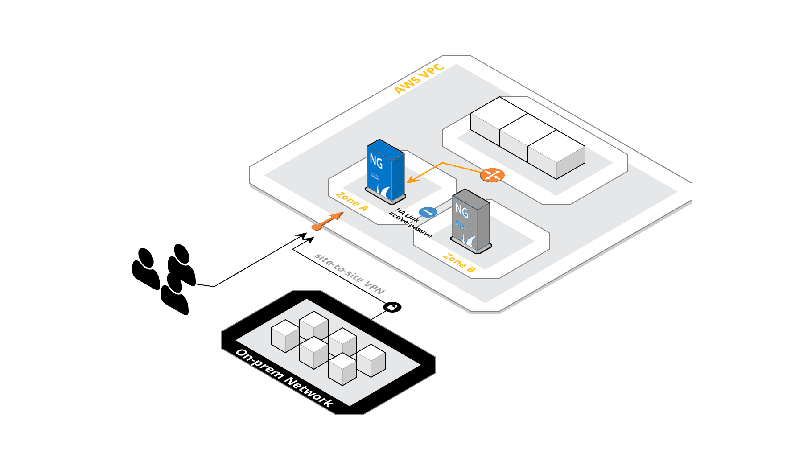

# HA Cluster of Barracuda CloudGen Firewalls

## Introduction
This template deploys a VPC with a multi-AZ High Availability cluster of Barracuda CloudGen Firewalls (stand-alone) with a floating EIP. The cluster works in active/passive mode, automatically rewriting route table upon failover and reassigning Elastic IP for directing ingress traffic from public Internet.

The HA Cluster can be used as a starting block for multiple use-cases and architectures including IPSec hub, Secure Remote Access or Transit VPC.

More information on the architecture can be found at [Barracuda Campus](https://campus.barracuda.com/product/nextgenfirewallf/doc/54264714/aws-reference-architecture-nextgen-firewall-high-availability-cluster-with-route-shifting/)

## HA Failover and Preemption
### Failover
Both firewall nodes constantly communicate via heartbeat connection and synchronize configuration as well as state data. As soon as the passive node detects active node's absence, it resumes operations and additionally executes following actions in AWS fabric:
1. rewrites routing table entries pointing to missing instance to itself
2. reassigns the EIP to itself

The failover time is usually around 10 seconds.

### Preemption
Barracuda CloudGen Firewall clusters do not fail back automatically to primary node in order to avoid possible flipping if the issue, which originally caused the HA failover, was not fixed. The cluster with secondary node active and primary node on stand-by is though fully operational and will fail over to primary automatically as soon as secondary is gone. The easiest procedure to achieve fail back in AWS environment is to simply reboot the active node.

### Resolving conflicts
In case both nodes become active at the same time (e.g. due to network split), the primary node will switch to stand-by.

## Deployment Prerequisites
Before attempting to deploy the solution you must create an IAM Role for Barracuda CloudGen Firewalls. See [How to Create an IAM Role for an F-Series Firewall in AWS](https://campus.barracuda.com/product/nextgenfirewallf/article/NGF71/AWSCreateIAMRoleFW/) for details.

Solution does not check for availability of requested instance types in a given region. Please consult AWS documentation for instance type availability. Barracuda recommends use of **m4** or **c4** series.

## Deployed resources
Following resources will be created by the template:
- One VPC with Internet Gateway and two public Subnets in 2 Availability Zones
- Route table for public networks
- Route table for private networks
- One Elastic IP for incoming traffic
- Two Barracuda CloudGen Firewalls
- Security Group allowing all traffic - we recommend to use an "Allow all" SG when filtering traffic using firewalls to streamline configuration and troubleshooting

The firewalls are deployed preconfigured as a cluster, so no additional manual action is required to configure the clustering. Although passive firewall is assigned an ephemeral public IP, it is hardly needed for operating the cluster after licensing is done (see [How to Activate and License a Standalone High Availability Cluster](https://campus.barracuda.com/doc/73719711/) at Barracuda Campus). Primary node constantly synchronizes all configuration and you should not introduce any changes directly on secondary node.

**Note** The backend subnets and resources are *not* automatically created by the template. This has to be done manually after template deployment has finished.

## Template Outputs
 - Public IP - the address of EIP used to accept the incoming traffic and for cluster management
 - Initial password - initial root password for cluster management (has to be changed upon first log in)

## Launching the Template
Use [CGF_HA_floatingEIP.json](https://s3.eu-central-1.amazonaws.com/cuda-cgf-templates/CGF_HA_floatingEIP.json) file to launch the solution or click the link below to launch into the last AWS region you used:

For additional instructions on how to launch a CloudFormation Template, consult AWS documentation or check [How to Deploy an F-Series Firewall in AWS via CloudFormation Template](https://campus.barracuda.com/product/nextgenfirewallf/article/NGF71/AWSDeployCloudFormationTemplate/) article in Barracuda Campus.

## Next Steps
Barracuda CloudGen firewalls can be managed via a Web Interface or using a dedicated tool: Firewall Admin (for Windows). Your cluster is deployed to use the latter method. Download Firewall Admin application from [Barracuda Download Portal](https://dlportal.barracudanetworks.com/#/search?page=1&type=3)

If you decided to use BYOL licensing, you need to acquire your license tokens. If you haven't purchased any, you can request free evaluation tokens using [Evaluation Request form](https://www.barracuda.com/purchase/evaluation/product/BNGCAW). Remember, you will need two tokens for two firewalls. More information on licensing and activation can be found in [Barracuda Campus](https://campus.barracuda.com/doc/73719711/). If you deployed Hourly or MeteredBilling versions, you do not need to take any additional steps for licensing.

## Additional Resources
[AWS Reference Architecture - CloudGen Firewall High Availability Cluster with Route Shifting](https://campus.barracuda.com/product/nextgenfirewallf/doc/54264714/aws-reference-architecture-nextgen-firewall-high-availability-cluster-with-route-shifting/)
